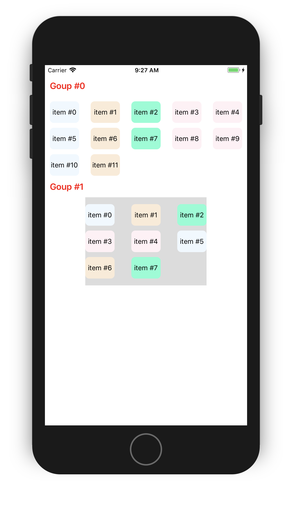
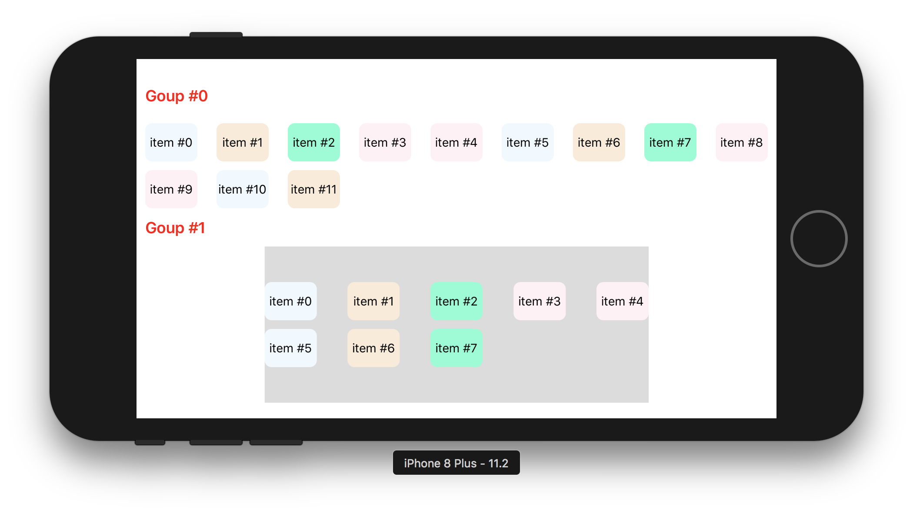
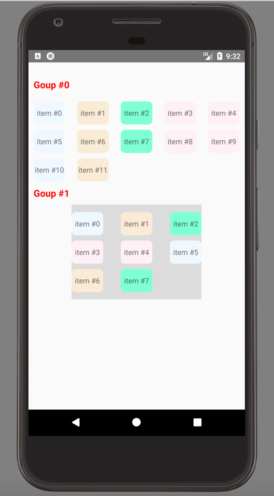
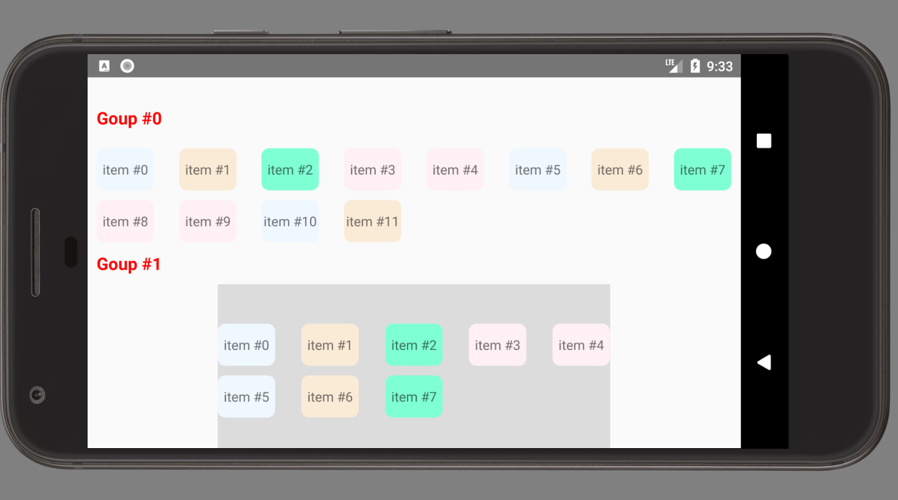

# react-native-flowable-gridview
A flowable view container, based on View component. Auto layout with different screen sizes.  
     
It does't reuse cell views. if your data is large, it will be poor efficiency. Using FlatList or List component instead. 

# Example

<div align="center">


</div>
<div align="center">


</div>

# Installation
```bash
npm install --save react-native-flowable-gridview
```
# Usage
```javascript
import FlowableGridView from 'react-native-flowable-gridview';

render() {
    const datas = Array(10).fill('').map((_,i) => ({key: i, text: `item #${i}`}));    
    return (
      <FlowableGridView
      style={{flex: 1}}
      dataSource={datas}
      itemWidth={60}
      columnSpace={20}
      rowSpace={10}
      keyExtractor={(data, index) =>  data.key}
      renderItem={(data, index)=>
            <View style={styles.item}>
              <Text>{data.text}</Text>
            </View>
      }
    />
}
```
# Properties
| Name | Type | isRequired | Default Value | Notes|
|---|---|---|---| ---|
| dataSource | Array | Yes |  |  |
| itemWidth | Number | Yes |  |  |
| columnSpace | Number | No | 0 | It is not real column space, but minimum value |
| rowSpace | Number | No | 0 |  |
| keyExtractor | Function: (data, index) => Object | No | return data index of dataSource |  |
| renderItem | Function: (data, index) => Component | Yes |  |  |
